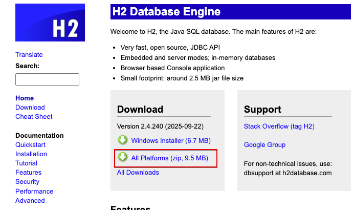

# 실전! 스프링 부트와 JPA 활용1 - 웹 애플리케이션 개발

## 1. 프로젝트 환경 설정

### H2 데이터베이스 설치

> [!IMPORTANT]
> Spring Boot `4.x`는 최소 H2 `2.4` 버전 이상을 사용해야 한다.[^1]



1. `jdbc:h2:~/jpashop`에 최초 접속, 데이터베이스 파일을 생성한다.
2. 정상적으로 접속되면 `~/jpashop.mv.db` 파일이 생성된다.
3. `jdbc:h2:tcp://localhost/~/jpashop`로 접속한다.

**참고 자료**

- [H2 Database Engine](https://www.h2database.com/html/main.html)

[^1]: [Spring Boot 4.0 Release Notes](https://github.com/spring-projects/spring-boot/wiki/Spring-Boot-4.0-Release-Notes)

## 2. 도메인 분석 설계

### 엔티티 클래스 개발

#### JPA Entity Annotation 작성 규칙

> [!NOTE]
> JPA Entity의 Annotation 순서는 관례가 없다. 하지만 프로젝트에서 일관되게 유지하면 가독성과 유지보수성을 높인다.

```java
@Entity
@Table(name = "member")
@Getter
@NoArgsConstructor(access = AccessLevel.PROTECTED)
public class Member {

    // === PK ===
    @Id
    @GeneratedValue(strategy = GenerationType.IDENTITY)
    @Column(name = "member_id")
    private Long id;

    // === 기본 필드 ===
    @Column(nullable = false)
    private String name;

    // === 연관 관계 ===
    @ManyToOne(fetch = FetchType.LAZY)
    @JoinColumn(name = "team_id")
    private Team team;
}
```

- Annotation은 의미 순서 기준으로 작성한다.
- Annotation은 한 줄에 하나씩 작성한다.
- 클래스/필드/관계별로 블록을 나누어 작성한다.
- Annotation은 한 줄에 하나만 작성한다

**클래스 레벨 Annotation 순서**

```text
@Entity
@Table(...)
@Inheritance(...)
@DiscriminatorColumn(...)
@DiscriminatorValue(...)
@Getter
@Setter
```

- JPA 핵심 -> 상속/매핑 -> 보조(Lombok)
- Lombok은 항상 마지막에 작성한다.

**필드 Annotation 순서**

PK 필드

```text
@Id
@GeneratedValue(...)
@Column(...)
```

연관 관계

```text
@ManyToOne(...)
@JoinColumn(...)
```

## 4. 회원 도메인 개발

### 회원 리포지토리 개발

#### JPQL 작성 권장 컨벤션

> [!NOTE]
> 공식적인 강제 규칙은 없다. 하지만 SQL과 동일한 방식을 따른다.

- 키워드는 대문자를 사용한다. (`SELECT`, `FROM`, `WHERE`)
- 엔티티명은 클래스 기준으로 작성한다.
- 별칭은 짧은 소문자를 사용한다.
- 필드는 엔티티 필드명을 사용한다.
- Named Parameter를 사용한다. (`:name`)
- JPQL은 SQL이 아니라 '객체 중심 쿼리'다.

### 회원 기능 테스트

#### 테스트 메서드 네이밍 규칙

```text
- givenMember_whenJoin_thenSuccess
- givenDuplicateMember_whenJoin_thenThrowException
```

- given-when-then 패턴을 사용한다.
- 형식: given[상황]_when[행동]_then[결과]
- 테스트 이름만 보고도 의도를 파악할 수 있어야 한다.

**참고 자료**

- [Baeldung 'Best Practices for Unit Testing in Java'](https://www.baeldung.com/java-unit-testing-best-practices)

## 6. 주문 도메인 개발

### 왜 Entity를 생성할 때 정적 팩토리 메서드를 사용했을까?

> 정적 팩토리 메서드는 객체를 '만드는 코드'가 아니라 '올바른 상태를 보장하는 도메인 규칙'이다.

```java
//==생성 메서드==//
public static Order createOrder(Member member, Delivery delivery, OrderItem... orderItems) {
    Order order = new Order();
    order.setMember(member);
    order.setDelivery(delivery);
    for (OrderItem orderItem : orderItems) {
        order.addOrderItem(orderItem);
    }
    order.setStatus(OrderStatus.ORDER);
    order.setOrderDate(LocalDateTime.now());
    return order;
}
```

- 객체를 생성하는 방법은 생성자, 정적 팩토리 메서드, 빌더 패턴이 있다.
  - 생성자: 간단한 객체 생성에 적합하다.
  - 정적 팩토리 메서드: 명명 가능, 복잡한 객체 생성에 적합하다.
  - 빌더 패턴: 가독성 높고, 복잡한 객체 생성에 적합하다.
- 정적 팩토리 메서드는 객체 생성 시 필수 값 누락을 방지한다.
- 연관관계의 일관성을 보장한다.
- 비즈니스 규칙을 생성 시점에 강제한다.
- 생성 경로를 하나로 제한하여 유지보수성을 높인다.
- 의미 있는 이름으로 가독성을 향상한다.
